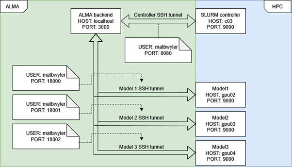

# Connecting ALMA and SLURM Controller

## General logic 

* **ALMA** runs on a machine in a different network from the one where the **SLURM Controller** runs. Machines within this same network as **SLURM Controller** will be running the LLMs that **ALMA** commands to start. To perform these commands, **SLURM Controller** enables an API listening on a specific node (in this example, **c03**), and **ALMA** sends requests to it to initiate SLURM jobs within the cluster, such as starting LLMs.
* **Tunnel requirement:** Since the API is not made publicly available, it is necessary to build a SSH tunnel to enable connections between **ALMA** and the **SLURM Controller**.
* **Main tunnel configuration:**
    * **ALMA Backend** (for example, host `localhost`, port `3000`) uses an open SSH tunnel that connects a local port (example: **port 8080**) to the remote port in the machine where **SLURM Controller** is deployed and listening (example: **port 9000**, node **c03**).
    * ALMA accesses the SLURM Controller API by sending requests to the local port that opens the tunnel (**localhost:8080**->**c03:9000**).
* **Connection to LLMs:**
    * Every LLM run has its own host and port (example: Llama in **gpu02:9000**).
    * Each model requires its own individual SSH tunnel.
    * **ALMA** reserves **2000 local ports** (example: **18000 to 19999**) to create tunnels for up to 2000 models.

---

## Environmental variables

### SLURM Controller variables
* **SLURM_CONTROLLER_BASE_URL:** Host and local port of the main tunnel (example: `http://localhost:8080`).
* **SLURM_CONTROLLER_URL:**
* **SLURM_CONTROLLER_ENDPOINT:**
* **SLURM_CONTROLLER_HOST:** Host of the URL used to connect to SLURM Controller (example: `localhost`).
* **SLURM_CONTROLLER_PORT:** Port of the URL used to connect to SLURM Controller (example: `8080`).
* **SLURM_CONTROLLER_TIMEOUT_MS:** Maximum wait time for trying to initiate the SSH tunnel connection with SLURM Controller.
* **SLURM_CONTROLLER_API_KEY:**

### Variables for the the running LLMs
* **SSH_TUNNEL_USER:** User of the HPC that runs the SLURM jobs (example: matbwyler).
* **SSH_TUNNEL_GATEWAY_HOST:**
* **SSH_TUNNEL_LOCAL_PORT_START / SSH_TUNNEL_LOCAL_PORT_END:** Range of ports reserved for SSH tunnels that connect to LLMs. These two values represent the beginning and end ports of the range (example: 18000 and 19999).
* **SSH_TUNNEL_READY_TIMEOUT_MS:** Maximum wait time for trying to initiate the SSH tunnel connection with any given LLM.
* **SSH_TUNNEL_SYNC_RETRY_ATTEMPTS:** Maximum number of retry attempts to start the SSH tunnel.
* **SSH_TUNNEL_SYNC_RETRY_DELAY_MS:** Wait time between retries.
* **SSH_TUNNEL_KEY_FILE:**
* **SSH_TUNNEL_KNOWN_HOSTS_FILE:**
* **SSH_TUNNEL_RESTART_DELAY_MS:** Wait time between SSH tunnel restart.
* **SSH_TUNNEL_MODEL_HEALTH_MAX_WAIT_MS:** Maximum time invested in validating that the tunnel is operational.
* **DEFAULT_MODEL_HEALTH_INTERVAL_MS:** Frequency at which the status of the LLM SSH tunnels is checked.

### Other variables
* **REMOTE_PORT:**
* **LOCAL_PORT:**
* **JOB_REGISTRATION_TIMEOUT_MS:** (may not apply to this document)
* **INTERNAL_API_BASE_URL:** (may not apply to this document)